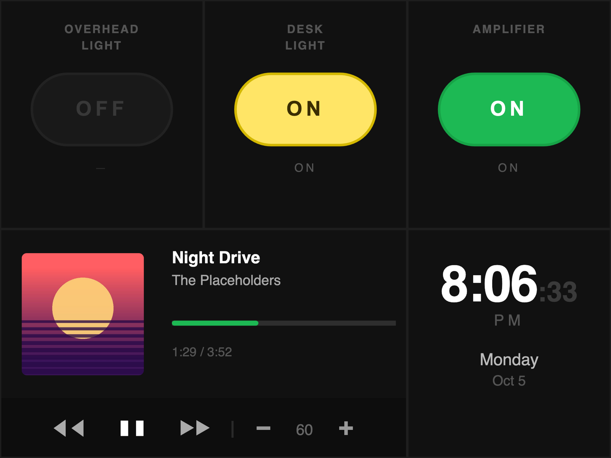
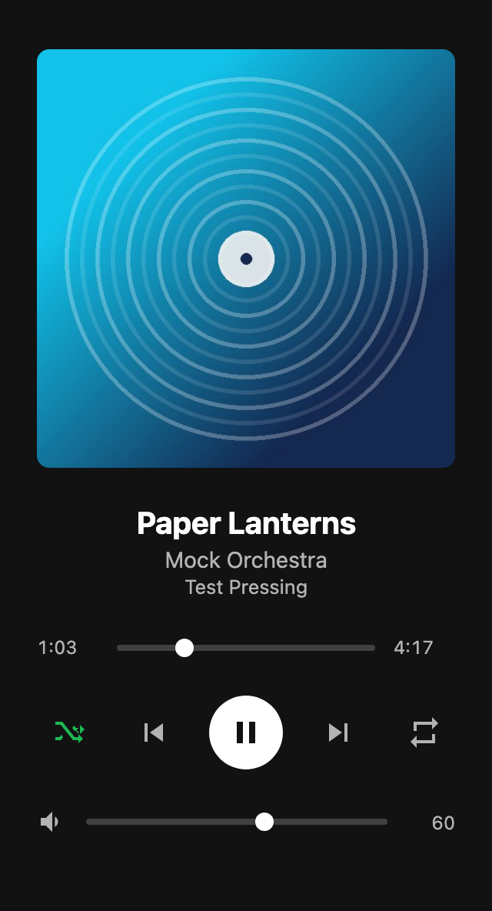
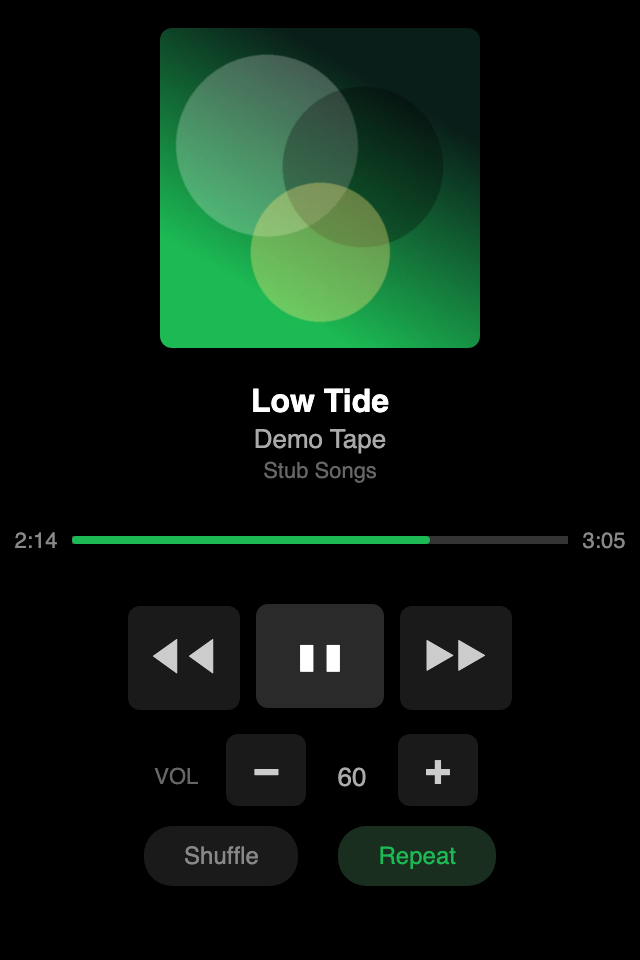
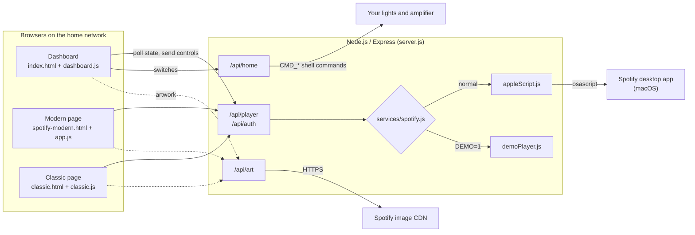

# HomeServer

A small Node.js server that turns an old iPod touch (or any browser on your network) into a desk control panel: a
smart home dashboard with light and amplifier switches, a clock, and remote control for the Spotify desktop app
running on a Mac.

It was built for an iPod touch on iOS 6. Devices that old can no longer run the current Spotify app or most modern
web apps, so the server does the real work on the computer and serves pages written for their old WebKit browsers.
There is also a modern page for current phones and browsers, and a legacy page for very old WebKit (iOS 3).

## Screenshots

All screenshots were captured from the running server in its demo mode (`DEMO=1`), so the tracks, artwork and switch
states are sample data. They were taken in headless Chromium with an iOS 6 Safari user agent at iPad and iPod touch
screen sizes.



*The smart home dashboard (`/`) on an iPad-sized screen in landscape.*

<table>
  <tr>
    <td width="40%"></td>
    <td width="30%"></td>
    <td width="30%"></td>
  </tr>
  <tr>
    <td><em>Dashboard at its native 480x360 layout (iPod touch width, landscape).</em></td>
    <td><em>Modern Spotify page (<code>/spotify-modern.html</code>), full page at 320 px wide.</em></td>
    <td><em>Classic Spotify page (<code>/classic.html</code>) for old WebKit, 320x480.</em></td>
  </tr>
</table>

## Features

- **Smart home dashboard** (`/`): on/off switches for an overhead light, a desk light and an amplifier, a now-playing
  panel (artwork, progress bar with tap to seek, previous / play-pause / next, volume up and down) and a clock with
  the day and date. Written in ES5 for iOS 6. It is a fixed 480x360 layout that scales up to fill iPad and desktop
  screens.
- **Modern Spotify page** (`/spotify-modern.html`): the page the project started from. Large artwork, seek slider,
  shuffle, repeat and a volume slider. It hooks into the browser's Media Session API, so lock screen and notification
  media controls on current devices control Spotify too.
- **Classic Spotify page** (`/classic.html`): the same controls with big buttons, written in ES3 for very old WebKit
  (iOS 3 onwards).
- **Artwork proxy**: album art is fetched by the server (Spotify's image CDN only) and cached, so the device only ever
  talks to this server.
- **Device hooks**: each switch can run a shell command when it turns on or off (for example a macOS Shortcut), set
  through environment variables.
- **Demo mode**: `DEMO=1` swaps Spotify for a built-in sample player and skips device commands, so you can try the
  pages on any machine.

## Running it

### Prerequisites

- Node.js 18 or newer (tested with Node 22).
- For real playback control: a Mac with the **Spotify desktop app running**. The server controls it through
  AppleScript (`osascript`), so the first request may trigger a macOS prompt asking to allow your terminal to control
  Spotify. Demo mode needs neither macOS nor Spotify.

### Start the server

```sh
git clone https://github.com/LBSiUK/HomeServer.git
cd HomeServer
npm install
npm start
```

The server listens on port 3000 on all network interfaces:

| Page | Address |
| --- | --- |
| Smart home dashboard | `http://localhost:3000/` |
| Modern Spotify-only page | `http://localhost:3000/spotify-modern.html` |
| Legacy Spotify-only page for old WebKit | `http://localhost:3000/classic.html` |

From the iPod touch or another device, use the computer's local network address instead of `localhost`, for example
`http://<computer-ip>:3000/`. On iOS, "Add to Home Screen" opens the dashboard and the classic page full screen.

### Try it without Spotify (demo mode)

```sh
npm run demo                  # same as DEMO=1 npm start
DEMO=1 PORT=9210 npm start    # demo mode on another port
```

### Tests

```sh
npm test
```

The tests start the app in demo mode on a random port and check the pages, the player and home APIs, input
validation and the JSON fallback used by old browsers. They never touch Spotify or any devices.

### Configuration

All settings are environment variables:

| Variable | Default | Purpose |
| --- | --- | --- |
| `PORT` | `3000` | Port to listen on. |
| `DEMO` | off | `1` uses the built-in sample player and skips all `CMD_*` commands. |
| `CMD_OVERHEAD_ON`, `CMD_OVERHEAD_OFF` | none | Shell command run when the overhead light switch turns on or off. |
| `CMD_DESK_ON`, `CMD_DESK_OFF` | none | Same for the desk light. |
| `CMD_AMP_ON`, `CMD_AMP_OFF` | none | Same for the amplifier. |

For example, with macOS Shortcuts that switch your devices:

```sh
CMD_DESK_ON="shortcuts run 'Desk On'" CMD_DESK_OFF="shortcuts run 'Desk Off'" npm start
```

Without any `CMD_*` variables the switches only change their on-screen state.

## Architecture



**How it fits together**

- `server.js` is a single Express app. It serves the static pages from `public/` and mounts the API routes.
- The pages poll `GET /api/player/state` every 3 seconds (and again within a second of a button press), then
  move the progress bar forward locally between polls. Buttons send `POST` requests such as `/api/player/next` or
  `/api/player/volume`.
- The player and auth routes call `services/spotify.js`, which picks a backend: `appleScript.js` runs AppleScript
  against the Spotify desktop app, and `demoPlayer.js` is an in-memory player with sample tracks for `DEMO=1`. Both
  expose the same functions.
- Artwork URLs from Spotify are rewritten to `/api/art?url=...`. That route fetches the image from Spotify's CDN
  (other hosts are refused) and lets the browser cache it for a day.
- `/api/home` keeps the switch states in memory (they reset when the server restarts) and runs the matching `CMD_*`
  command, if one is set, on each change.
- `/api/silence` returns half a second of silent audio. The modern page loops it because browsers only show Media
  Session controls while something is playing.
- `public/json-polyfill.js` supplies `JSON.parse` and `JSON.stringify` on browsers that lack them (iOS 3), and is
  loaded before the dashboard and classic scripts.

**API**

| Method and path | What it does |
| --- | --- |
| `GET /api/auth/status` | Whether Spotify is running. |
| `POST /api/auth/open` | Launches Spotify. |
| `GET /api/player/state` | Current track, progress, volume, shuffle and repeat (`204` when nothing is playing). |
| `POST /api/player/play`, `pause`, `next`, `previous` | Playback controls. |
| `POST /api/player/seek` | Body `{ "positionMs": 90000 }`. |
| `POST /api/player/volume` | Body `{ "volumePercent": 0-100 }`. |
| `POST /api/player/shuffle` | Body `{ "state": true }`. |
| `POST /api/player/repeat` | Body `{ "state": "off" \| "context" \| "track" }` (on/off only in practice). |
| `GET /api/devices` | Lists the local computer as the only playback device. |
| `GET /api/home/state` | Switch states. |
| `POST /api/home/:device/toggle`, `/api/home/:device/set` | Toggle or set (`{ "on": true }`) `overhead`, `desk` or `amplifier`. |
| `GET /api/art?url=...` | Artwork proxy for Spotify CDN images. |

**Project layout**

```text
HomeServer/
├── server.js              Express app: static files, API routes, silent audio
├── config.js              PORT and DEMO settings
├── routes/
│   ├── auth.js            Spotify running / launch
│   ├── player.js          playback state and controls
│   ├── devices.js         playback device list (local only)
│   ├── albums.js          artwork proxy (/api/art)
│   └── home.js            light and amplifier switches
├── services/
│   ├── spotify.js         chooses the backend below
│   ├── appleScript.js     drives the Spotify desktop app via osascript
│   └── demoPlayer.js      sample player for DEMO=1
├── middleware/
│   └── errorHandler.js    JSON error responses
├── public/
│   ├── index.html, dashboard.js, dashboard.css             smart home dashboard (ES5)
│   ├── spotify-modern.html, app.js, style.css              modern Spotify page
│   ├── classic.html, classic.js, classic.css               legacy Spotify page (ES3)
│   ├── json-polyfill.js   JSON fallback for iOS 3
│   └── demo/              placeholder artwork for demo mode
├── test/
│   └── api.test.js        node:test smoke tests (demo mode)
└── docs/screenshots/      README images
```

## Status and limitations

- **The switches match one particular setup.** The overhead light, desk light and amplifier are the devices this was
  built around. Nothing is connected out of the box: set the `CMD_*` variables, or edit `routes/home.js` and
  `public/index.html` for your own devices. The server does not read back the real state of a device.
- **Spotify control needs macOS and the Spotify desktop app running**, because it works through AppleScript. It
  controls the app on the same computer only: switching Spotify Connect devices is not available, and repeat is
  simply on or off.
- **There is no authentication.** Anyone who can reach the port on your network can control playback and the
  switches, so keep it on a trusted home network and do not expose it to the internet.
- **Browser support.** iOS 6 is the main target and displays all three pages as intended. On iOS 3 a few visual
  details differ because of its simpler rendering. The modern page uses current JavaScript and needs a recent
  browser; on old devices use the classic page.
- **iOS 3 fixes not yet confirmed on a device.** Two problems were reported on iOS 3: the Spotify panel on the
  dashboard did not work, and volume control did nothing on the classic page. Both came from iOS 3's missing native
  JSON support and are addressed by `json-polyfill.js`. The fix has been tested in a desktop browser with JSON
  removed, but not yet on real iOS 3 hardware.
